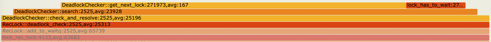

# PT Flame Graph

## Background

### On/off-CPU Analysis

Performance anlysis usually starts from on-CPU analysis. Profilers like perf can capture activities on CPU and pinpoint program hotspot. [CPU Flame Graph](https://www.brendangregg.com/FlameGraphs/cpuflamegraphs.html) summarizes large and unreadable profile results and visualizes program stack based on CPU usage. In CPU intensive scenarios, on-CPU analysis can quickly pinpoint performance bottlenecks. Below is Flame Graph collected from PolarDB during sysbench oltp_read_write benchmark. CPU % on each program stack can be easily read off the graph.


On-CPU analysis, however, can not capture program time spent on waiting off-CPU. In IO intensive scenarios, threads are often blocked waiting for IO. On-CPU analysis would be unable to locate performace issue. With [off-CPU analysis](https://www.brendangregg.com/offcpuanalysis.html), context switch events and corresponding program stack can be recorded and visualized in off-CPU flame graph, where long blocking function calls are shown prominently. Off-CPU flame graph contains only blocking calls. Lack of blocking context may make performance anlysis difficult for large programs and complex workloads if off-CPU flame graph is used alone. Below is off-CPU Flame Graph collected from PolarDB during sysbench oltp_read_write benchmark. Disk IO, network latency, background sleep, and all off-CPU time can be read off this graph.


On-CPU analysis and off-CPU analysis are complementary. Ideally, a single graph with both on-CPU and off-CPU components should contain entire program time spent during profiling, and enables a more complete overview for performance analysis, where direct comparison between on-CPU and off-CPU time can be made. [Hot/Cold Flame Graphs](https://www.brendangregg.com/FlameGraphs/hotcoldflamegraphs.html) provides several solutions to utilize both graphs. Notably, [eflame](https://github.com/proger/eflame) is an ideal solution where both graphs are integrated into one complete wall-time flame graph. But the tool designed for Erlang only and therefore not suitable for generic programs.

### Wall-time Analysis

Another quick performace analysis method is to print call stacks. Tools like [pt-pmp](https://docs.percona.com/percona-toolkit/pt-pmp.html) can automate this process and summarize program stack, enabling a coarse-grain view into program behavior, regardless of specific program and workload, since stacks for both active and inactive threads can be printed. With stable program behavior, call stack can be repeatedly printed to produce a finer-grained flame graph. However, printing stacks is usually costly and will momentarily freeze sampled program, and may have significant performance impact when done with high frequency.

## Flame Graph Based-on Intel PT

Below is PT-based Flame Graph collected from PolarDB during sysbench oltp_read_write benchmark. Wall time of collected stacks are displayed in this graph, which contains both on-CPU and off-CPU component. Stack proportion reflects program execution time.


Intel PT uses dedicated hardware on intel processors to captures running program. With PT, complete program trace and precise timestamps can be recorded with minimal performance impact. Perf [supports collecting trace data and synthesizing instruction events](https://www.man7.org/linux/man-pages/man1/perf-intel-pt.1.html). For example, one can use perf to collect PT data and produce call return trace:

```bash
perf record -m,32M -e intel_pt/cyc/u -C<cores>
perf script --itrace=cr --ns -F-event,-period,+addr,-comm,+flags,-dso
```

Sample results:

```
114078 [000] 858572.850211120:   call                            3b4ee4a mem_heap_block_free+0x1a =>          3b4eb80 mem_block_validate+0x0
114078 [000] 858572.850211120:   return                          3b4edc0 mem_block_validate+0x240 =>          3b4ee4f mem_heap_block_free+0x1f
114078 [000] 858572.850211195:   call                            3b4ef0d mem_heap_block_free+0xdd =>          3d5b550 pfs_memory_free_v1+0x0
114078 [000] 858572.850211195:   call                            3d5b560 pfs_memory_free_v1+0x10 =>          3d77d60 find_memory_class+0x0
114078 [000] 858572.850211214:   return                          3d77d93 find_memory_class+0x33 =>          3d5b565 pfs_memory_free_v1+0x15
114078 [000] 858572.850211214:   return                          3d5b63c pfs_memory_free_v1+0xec =>          3b4ef10 mem_heap_block_free+0xe0
```

Call return trace contains thread id, CPU number, timestamp, instruction, and program symbol. Function calls and stack history can be replayed on a per-thread basis, and function occurrence and duration can be calculated with matching function call and return instructions. Trace above produces following call stack:

```
mem_heap_block_free (?ns) 
│
├─► mem_block_validate (0ns) 
│
└─► pfs_mempry_free_v1 (19ns) 
    │
    └─► find_memory_class (19ns) 
```

Or in flame graph format：

```
mem_heap_block_free;mem_block_validate 0
mem_heap_block_free;pfs_mempry_free_v1 0
mem_heap_block_free;pfs_mempry_free_v1;find_memory_class 19

```

Since function duration is calculated from instruction timestamps, both on-CPU time and off-CPU time is included, which makes the flame graph a wall-time flame graph.

Compared to common performance analysis methods:

1. PT flame graph captures complete program time, including on-CPU time and time spent blocked. Idle background threads can be captured as well.
2. PT is based on recording rather than sampling. Function duration and occurrance can be directly shown on flame graph, instead of simply CPU usage percentage.
3. Due to 2., PT flame graph disdinguishes repeated call to fast function from long running functions.
4. Comparing two on-CPU flame graphs with tools like [Differential Flame Graph](https://brendangregg.com/blog/2014-11-09/differential-flame-graphs.html) usually requires normalizing graphs by total sample count. This is not necessary for PT flame graph since function duration can be directly compared between runs.
5. Campared to printing stack, PT flame graph produces a more accurate and much finer-grained result.

## Use Case

PolarDB exhibits performance regreession in hotspot update scenario, where a large amount of SQL attempts to update one or very few rows of data in a single table. Even with ample CPU resource, PolarDB performance decrease with the increase of concurrent update statement. The following table shows PolarDB update performance with regard to concurrency.

| concurrrent updates | QPS  | CPU% |
|---------------------|------|------|
| 16                  | 19k  | 1400 |
| 256                 | 12k  | 1700 |
| 1024                | 5.2k | 1200 |

PT flame graph recorded at 16 concurrent update scenario


Extra infomation is annotated on flame graph with format:

```
<symbol>:<occurance>(<incomplete occurance>),avg:<average duration(ns)>
```

From PT flame graph, it is apparent SQL thread (`do_command`) spends most time on `pthread_cond_wait`, where row lock request is being blocked. A row of data can be updated by only one thread at a time. When a large amount of update request is being sent concurrently, row lock is the bottle neck.

Record another PT flame graph at 1024 concurrency, and compare several function durations in transaction system critical section (ns):

| action \\ duration \\ concurrency | 16           | 1024  |
|-----------------------------------|--------------|-------|
| deadlock detection                | 1613         | 25313 |
| update transaction weight         | not captured | 20066 |
| add row lock to global hash table | 182          | 19218 |


In deadlock detection, function `get_next_lock` is fast, but called very frequently



MySQL keeps transaction locks in a global hash table with separate chaining. With a large number of row locks on very few rows, hash table is essentially a linked list. Traserving long linked list is costly, resulting in performance regression under high concurrency.

After optimizing related code, PolarDB archives 9.3k QPS under 1024 concurrent updates, up \~80%.

## Known Defects

1. PT produce a huge amount of data
    - In multi-core, heavy CPU load scenarios, PT may only be enabled for a very short time (<1s) to reduce data process time in later steps.
    - perf is very slow to produce instruction trace from PT data. We maintain a internal fork of perf that does perf script in parallel for PT to mitigate this problem.
    - Data loss is virtually inevitable and resulting trace is usually incomplete. PT flame graph will contain incomplete or incorrect stack. In practice, however, stack inaccuracy is not significant enough to affect overall the flame graph.
2. Call stack is inferred from call/return trace.
    - Functions close to stack botton are more likely to be missing. Function durations are likely to bias toward top of stack.
    - Some special function calls are not implemented with call/return, e.g. virtual function or some glibc internal functions. Related call/return instructions may not match.
    
## Related Tools

- [magic-trace](https://github.com/janestreet/magic-trace) collects PT data in snapshot mode, replays program history and visualize program execution history with an interactive user interface. magic-trace does not further aggregate reconstructed stacks or summarize function durations.
- [Generating Flame graphs with Processor Trace](http://halobates.de/blog/p/329) generates flame graph with stack samples produced by perf with instruction smapling, resulting in an on-CPU flame graph that is essentially the same with common CPU flame graph.

## References

- [Intel® 64 and IA-32 Architecture Developer Manuals](https://www.intel.cn/content/www/cn/zh/developer/articles/technical/intel-sdm.html)
- [perf-intel-pt(1) — Linux manual page](https://www.man7.org/linux/man-pages/man1/perf-intel-pt.1.html)
- [Flame Graphs](https://www.brendangregg.com/flamegraphs.html)
