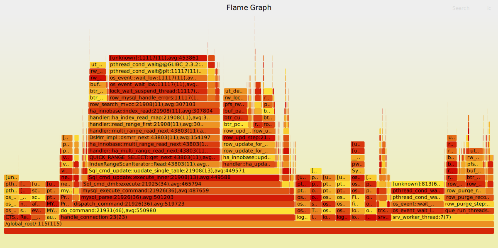

# PT 火焰图工具

## 背景

### On/off-CPU 分析

做性能分析时，通常会从 on-CPU 分析入手。使用 perf 等剖析工具采集程序栈，分析 CPU 上的活动，然后找到程序的热点。[火焰图](https://www.brendangregg.com/FlameGraphs/cpuflamegraphs.html)解决了剖析信息长且很很难读的问题，使用调用栈信息生成可视化的展示出 CPU 上的热点。在 CPU 密集的场景，on-CPU 分析通常可以快速定位到热点函数。下图是 PolarDB
在 sysbench oltp\_read\_write 场景采集到的火焰图，可以看到 CPU 在每个栈上所花时间的比例。


但是，on-CPU 分析无法获得线程阻塞或被切出的时间。例如在 IO 密集的场景下，程序经常阻塞在 IO 上，但是 on-CPU 分析看不到程序把时间花在哪里，无法定位性能问题。借助 [off-CPU 分析](https://www.brendangregg.com/offcpuanalysis.html)，程序切出的事件和相应的调用栈可以被记录下来，从而获得程序阻塞的时间和上下文，定位到性能问题。off-CPU 火焰图只包含线程阻塞的调用栈，在复杂的程序中，仅使用 off-CPU 分析可能缺少必要的必要的上下文来更精确的定位到具体的性能瓶颈。下图是 PolarDB 同场景采集到的 off-CPU 火焰图，可以看到数据库不同线程在磁盘 IO、网络和后台睡眠等不在 CPU 上的时间。


On-CPU 和 off-CPU 分析是互补的。在理想的情况下，如果能把 on-CPU 火焰图和 off-CPU 火焰图结合起来，放在一张图中，就可以获得程序完整的时间分布，从全局的视角定位性能问题，并且可以直接比较程序 on-CPU 时间和 off-CPU 时间。[冷热火焰图](https://www.brendangregg.com/FlameGraphs/hotcoldflamegraphs.html)提供了结合 on-CPU 火焰图和 off-CPU 火焰图的方案，其中 [eflame](https://github.com/proger/eflame) 提供了一个理想的解决方案。eflame 可以整合两种火焰图，生成程序的挂钟时间火焰图。但是这个工具是针对 Erlang 设计的，不适用于通用的场景。

### 挂钟时间分析

另一种快速分析性能问题的方法是直接打印调用栈。不管程序是 CPU 密集还是 IO 密集，使用 [pt-pmp](https://docs.percona.com/percona-toolkit/pt-pmp.html) 等自动化工具打印并聚合栈，就可以看到程序当前的行为，粗粒度的定位到性能问题。在程序行为稳定的情况下，如果能够打印出足够多的调用栈并聚合结果，就能够以更细的粒度做挂钟时间分析。但是，pstack 等打印调用栈的工具通常速度比较慢，并且会短暂的影响程序运行，不适合长时间反复调用。

## 基于 PT 的火焰图工具

下图是 PolarDB 同场景采集到的基于 PT 的火焰图。图上可以看到数据库各线程在每个栈上所花的挂钟时间。火焰图既包含 on-CPU 的部分，也包含 off-CPU 的部分， 并且两个部分的相对比例代表了程序执行的实际时间。


Intel PT 是 intel 处理器上专门用于追踪处理器执行流的硬件，能以较低的开销、非常高的时间精度完整的记录处理器执行历史。而 perf 工具支持 [PT 数据的采集和解析](https://www.man7.org/linux/man-pages/man1/perf-intel-pt.1.html)，使用 perf 采集并解析 PT 数据，可以生成带有高精度时间戳的程序执行历史。

例如，使用 perf 采集 PT 数据，然后使用 perf 解析

```bash
perf record -m,32M -e intel_pt/cyc/u -C<cores>
perf script --itrace=cr --ns -F-event,-period,+addr,-comm,+flags,-dso
```

可以得到类似于这样的结果：

```
114078 [000] 858572.850211120:   call                            3b4ee4a mem_heap_block_free+0x1a =>          3b4eb80 mem_block_validate+0x0
114078 [000] 858572.850211120:   return                          3b4edc0 mem_block_validate+0x240 =>          3b4ee4f mem_heap_block_free+0x1f
114078 [000] 858572.850211195:   call                            3b4ef0d mem_heap_block_free+0xdd =>          3d5b550 pfs_memory_free_v1+0x0
114078 [000] 858572.850211195:   call                            3d5b560 pfs_memory_free_v1+0x10 =>          3d77d60 find_memory_class+0x0
114078 [000] 858572.850211214:   return                          3d77d93 find_memory_class+0x33 =>          3d5b565 pfs_memory_free_v1+0x15
114078 [000] 858572.850211214:   return                          3d5b63c pfs_memory_free_v1+0xec =>          3b4ef10 mem_heap_block_free+0xe0
```

包含线程号、CPU 号、时间戳、指令和函数符号。我们可以按线程回放函数调用的历史，并在回放的过程中重建函数调用栈，同时计算函数调用的时间。上面的 trace 可以回放出这样的调用栈：

```
mem_heap_block_free (?ns) 
│
├─► mem_block_validate (0ns) 
│
└─► pfs_mempry_free_v1 (19ns) 
    │
    └─► find_memory_class (19ns) 
```

按照火焰图的格式：

```
mem_heap_block_free;mem_block_validate 0
mem_heap_block_free;pfs_mempry_free_v1 0
mem_heap_block_free;pfs_mempry_free_v1;find_memory_class 19

```

因为 trace 是按照线程回放的，不管是 on-CPU 时间还是 off-CPU 时间都会统计在内。把所有的栈聚合在一起产生火焰图，就获得了结合 on-CPU 和 off-CPU 的火焰图。

比较常用的性能分析方法：

1. PT 火焰图可以看到程序的全部时间（也就是挂钟时间分析），除了在 CPU 上的开销，也能捕获线程阻塞的时间，也可以看到空闲的后台线程（即 off-CPU 的部分）。
2. PT 火焰图的 sample 即时间，可以之间看到函数调用时间和调用次数，而不仅仅是占用时间的比例
3. 由于 2 ，PT 火焰图可以区分“短函数被反复调用”和”长函数被少量调用“两种场景
4. on-CPU 分析往往通过采样的方式获得 CPU 行为，函数的热点以占用 CPU 比例的形式展示出来。因此使用类似[差分火焰图](https://brendangregg.com/blog/2014-11-09/differential-flame-graphs.html)的工具比较两张火焰图时，通常需要对其中一张火焰图的采样数量按比例缩放，并且只能比较函数占用时间的比例。而 PT 火焰图可以直接比较函数调用时间。
5. 相比直接打印调用栈，PT 火焰图粒度更细、精度更高。

## 使用案例

PolarDB 在处理热点更新场景（大量 SQL 更新表中的一行或少量的几行）时，即使有充足的 CPU 资源，也会出现性能随并发更新数量的上升而衰退的情况。下表列出了并发更新一个表中 10 行时 PolarDB 的性能。

| 并发 | QPS  | CPU% |
|------|------|------|
| 16   | 19k  | 1400 |
| 256  | 12k  | 1700 |
| 1024 | 5.2k | 1200 |

在 16 并发场景采集 PT 火焰图



图上在函数名后额外标注了相关信息，格式如下：

```
<函数名>:<调用次数>(<不完整采集的次数>),avg:<平均调用时间ns>
```

在 PT 火焰图上可以很明显看到，SQL 线程执行一次语句（`do_command`）的时间主要在 `pthread_cond_wait` 上。结合代码，这是 SQL 线程在获取行锁时被阻塞。一行数据只能同时被一个 SQL 更新，有很多 SQL 线程试图更新时，系统的瓶颈是行锁资源，自然会有很多程序时间花在等待行锁上。

在 1024 并发场景下采集 PT 火焰图，比较 16 并发和 1024 并发在事务锁系统临界区的耗时。下表列举了 PT 火焰图中拿行锁时几个关键部分的延迟（ns）：

| 行为               | 16并发 | 1024并发 |
|--------------------|--------|----------|
| 死锁检测           | 1613   | 25313    |
| 更新事务权重       | 很小     | 20066    |
| 行锁加入全局哈希表 | 182    | 19218    |


在死锁检测中，`get_next_lock`函数虽然单次调用时间很短，但是调用次数非常高。


结合代码可以发现，由于并发高、行锁多，遍历行锁的开销很大。MySQL 在记录行锁时使用开散列的哈希表，但是行锁很多且很集中时，哈希表退化成链表。许多行锁的操作需要遍历链表，导致热点更新场景在并发高时性能衰退。

对相关代码优化后，1024 并发下可以达到 9.3k QPS，上升约 80%。

## 已知问题

1. 数据量大
    - 在多核、高 CPU 负载的场景下，为了控制处理数据的时间，只能短时间的采集数据（<1s）。
    - perf script 产生 trace 的时间非常长。为了缓解这个问题，我们在内部为 PT 维护了一个特殊版本的 perf，可以并发生成 trace，减少处理时间。
    - 采集数据时经常出现数据缺失的情况，导致采集到的 trace 不完整，产生的火焰图中可能出现推断错误的栈。实践中，推导错误的调用栈占比非常低，在火焰图上没有明显的影响。
2. 调用栈是通过回放 call/ret 指令推导的
    - 接近栈底的函数可能采集的偏少甚至没有采集到，导致栈底函数延迟偏低或不可见。
    - 在一些特殊场景函数的调用和返回可能不完全匹配，影响调用栈的推导。例如虚函数使用的 vtable 和一些库函数在内部使用的跨函数跳转。

## 相关工具

- [magic-trace](https://github.com/janestreet/magic-trace) 使用了 PT 的快照模式采集数据，并回放函数调用历史，使用了一套交互式的界面展示结果，但是 magic-trace 并没有对函数调用历史做进一步整理和总结。
- [Generating Flame graphs with Processor Trace](http://halobates.de/blog/p/329) 使用 PT trace 产生火焰图，但是使用了 perf script 的指令采样模式直接生成调用栈，在本质上仍然是 on—CPU 火焰图。

## 引用

- [Intel® 64 and IA-32 Architecture Developer Manuals](https://www.intel.cn/content/www/cn/zh/developer/articles/technical/intel-sdm.html)
- [perf-intel-pt(1) — Linux manual page](https://www.man7.org/linux/man-pages/man1/perf-intel-pt.1.html)
- [Flame Graphs](https://www.brendangregg.com/flamegraphs.html)
